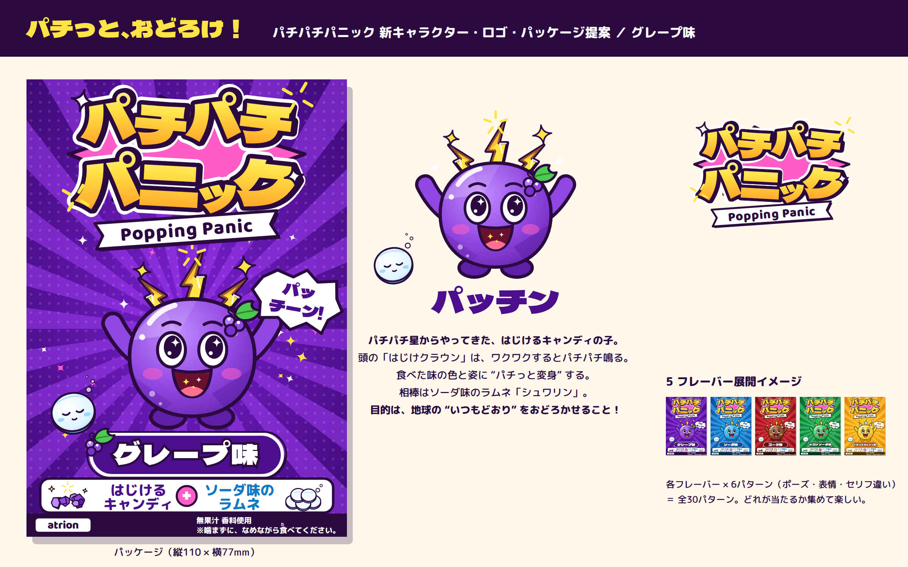

# パチパチパニック リニューアル提案 — 「パッチン」

全国流通の駄菓子「パチパチパニック」の新キャラクター・ロゴ・パッケージデザインのコンペ提案です（題材：グレープ味）。

**企画書：[docs/proposal.md](docs/proposal.md)**



## 提出物

| 必須提出物 | ファイル |
|---|---|
| パッケージデザイン（グレープ味・縦110×横77mm） | [exports/package_grape.png](exports/package_grape.png) / [design/package_grape.svg](design/package_grape.svg) |
| 新キャラクターデザイン | [exports/character_sheet.png](exports/character_sheet.png) ほか |
| 新ロゴデザイン | [exports/logo.png](exports/logo.png) / [design/logo.svg](design/logo.svg) |
| キャラクター名 | **パッチン**（相棒：シュワリン） |
| 性格・設定・世界観 | [docs/proposal.md](docs/proposal.md) |
| 短尺動画（15秒・縦型） | [video/pacchin_teaser.mp4](video/pacchin_teaser.mp4) |

## 構成

```
design/        SVG マスター（tools/build.py が生成）
  patterns/    グレープ味 6 パターン
  flavors/     5 フレーバー展開イメージ
exports/       PNG 書き出し
video/         動画ソース（index.html をブラウザで開くとリアルタイム再生）と MP4
tools/         生成スクリプト
assets/fonts/  使用フォント（すべて SIL Open Font License）
```

## 再生成

```sh
npm install
pip install imageio-ffmpeg     # 動画の書き出しに使う
./tools/export.sh              # SVG と PNG を生成
node tools/render_video.mjs    # video/pacchin_teaser.mp4 を生成
```

## 入稿前にやること（採用後）

- atrion ロゴは仮置きなので、支給データに差し替える
- ロゴはオリジナルのレタリングに描き起こす（現在は Dela Gothic One ベースの試作）
- 文字をすべてアウトライン化し、CMYK で色校正する
- 塗り足しとトンボを付ける（展開図は支給待ち）
