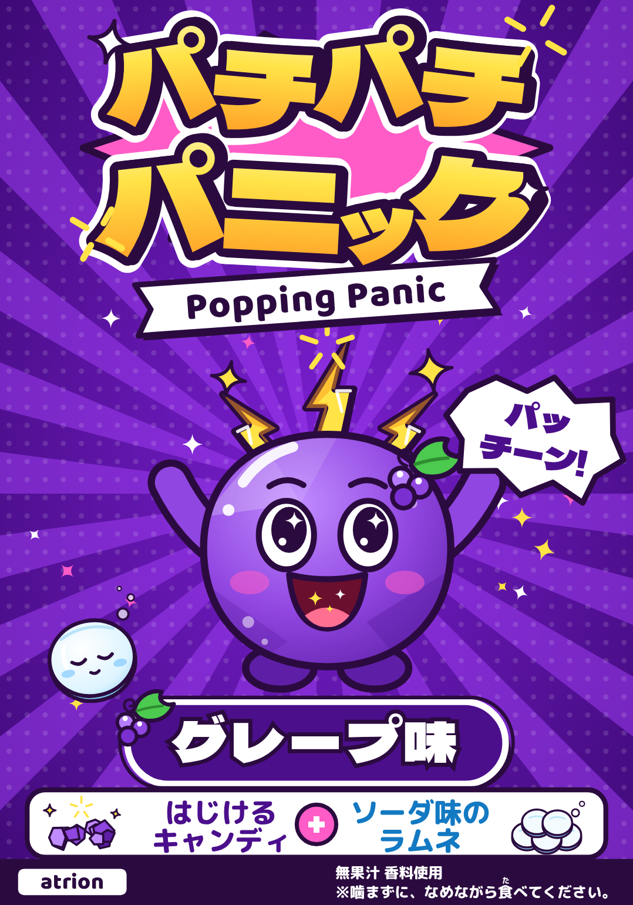

# パチパチパニック リニューアル提案

**題材：パチパチパニック グレープ味（縦110 × 横77mm）**

---

## 1. コンセプト

### 「パチっと、おどろけ！」

「パチパチパニック」の強みは、口の中で**本当にはじける**体験です。国内ではアトリオン製菓しか作っていない、はじけるキャンディです。
今回の提案では、その「パチッ」を**キャラクターの体の仕組みそのもの**にしました。

- パッケージを見た瞬間に「はじけそう」と伝わる（**驚き**）
- 表情とポーズが 6 種類あって、どれが当たるか楽しめる（**楽しさ**）
- 食べた味によって姿が変わるので、新しい味やコラボが出るたびに次のパッチンを見たくなる（**ワクワク感**）

---

## 2. キャラクター

### 主人公：パッチン（PACCHIN）

| 項目 | 設定 |
|---|---|
| 名前 | **パッチン**（はじける音「パッチーン！」から） |
| 出身 | パチパチ星（ポッピング・プラネット） |
| 正体 | はじけるキャンディのかけらから生まれた、キャンディ結晶の子ども |
| 大きさ | キャンディひと粒ぶん。気分が上がると頭のクラウンがパチパチ鳴る |
| チャームポイント | 頭の**はじけクラウン**（3本のイナズマ）。口の中でもいつもパチパチしている |
| 口ぐせ | 「パッチーン！」「びっくりした？」 |
| 性格 | 好奇心のかたまり。いたずら好きだけど、みんなを笑わせるのがいちばん好き。すぐ驚いて、すぐ笑う |
| 苦手なもの | 「いつもどおり」「たいくつ」。見つけるとパチパチしたくなる |
| 特技 | **パチっと変身**：食べた味の色や姿に、パチっと変わる |

#### ストーリー

> パチパチ星では、星の中心がいつもパチパチはじけています。その音から生まれたのがパッチン。
> ある日パッチンは、望遠鏡で地球をのぞいて気づきました。「地球の毎日、ちょっと“いつもどおり”すぎない？」
> そこでパッチンは、はじけるキャンディをポケットいっぱいに詰めて地球へ飛び出しました。
> 目的はひとつ。**地球じゅうの“いつもどおり”を、パチっとおどろかせること！**

#### パチっと変身（フレーバー展開のしくみ）

パッチンの体は透き通ったキャンディ結晶です。食べた味の色にパチっと染まり、頭にその味のアクセサリーが生えます。

| フレーバー | 体の色 | アクセサリー | 背景 |
|---|---|---|---|
| グレープ | むらさき | ぶどうの房と葉っぱのヘアピン | ディープパープル |
| ソーダ | スカイブルー | シュワシュワの泡 | ブルー |
| コーラ | コーラブラウン | 王冠キャップ | レッド |
| メロンソーダ | メロングリーン | さくらんぼ | グリーン |
| レモンスカッシュ | レモンイエロー | レモンスライス（クラウンはホワイト＆アクア） | オレンジイエロー |

どのフレーバーでも、**イナズマ型のはじけクラウン**、**主線の色**、**目と口の描き方**は変えません。店頭で色が違っても、ひと目で「パッチンの商品」と分かるようにするためです。

- **新フレーバー**：味を食べれば新しい姿になるので、設定を足すだけで増やせます。
- **新カテゴリー（チョコなど）**：「チョコを食べたパッチン」として、世界観を崩さずに登場できます。
- **他社コラボ**：「〇〇を食べたパッチン」という形で、相手のブランドカラーやモチーフをアクセサリーとして取り込めます。

### 相棒：シュワリン（SHUWARIN）

| 項目 | 設定 |
|---|---|
| 名前 | **シュワリン** |
| 正体 | ソーダ味のラムネ。パッチンと同じロケットで地球に来た |
| 性格 | のんびり、マイペース。いつも眠そうだけど、実はいちばんの物知り |
| 口ぐせ | 「シュワ〜」 |
| 関係 | パッチンがはじけすぎると、シュワっと落ち着かせるツッコミ役 |

**パッチン（はじけるキャンディ）＋シュワリン（ラムネ）＝ パチパチパニック**
商品の中身がそのままコンビになっているので、「キャンディとラムネが入ったお菓子」だと自然に覚えてもらえます。
元気なパッチンとのんびりのシュワリンという対比は、アニメ・SNS・マンガで掛け合いにしやすい組み合わせです。

### 世界観の広がり（将来の展開案）

- **パチパチ星の仲間たち**：パッチンのほかにも、はじけるキャンディから生まれた「パチパチ隊」がいる。コラボや限定品ではゲストとして登場できる
- **敵役「タイクツ団」**：世界から驚きを消そうとするモヤモヤ雲。動画や販促キャンペーンで戦う相手として使える
- **大人向け**：色を抑えた線画パッケージ、アパレル向けのワンポイント（クラウンだけ）、「パチっと気分転換」をテーマにした大人向けコピーなど

---

## 3. ロゴ

- 「パチパチ」は 1 文字ずつ上下に傾けて、**はじけて跳ねるリズム**を作っています。「パニック」は下の段で大きく、どっしりさせました
- 文字の後ろには**はじけるバースト形**、文字のまわりには**イナズマの火花**を置き、キャラクターのクラウンと同じモチーフでそろえています
- 太い主線と白フチの二重フチなので、駄菓子売場の小さな面でも、にぎやかな棚の中でも埋もれません
- 下に「**Popping Panic**」のリボンタグを付けました。英字だけでも使えるので、海外展開やグッズでも使い回せます
- 単色版（`design/logo_mono.svg`）も用意しました。1 色印刷やグッズの刺しゅうに使えます

※本提案のロゴは Dela Gothic One（SIL OFL）をベースにした試作です。採用後はオリジナルのレタリングに描き起こし、アウトライン化したデータで納品します。

---

## 4. パッケージ（グレープ味）

### レイアウト（上から）

1. **ロゴ＋Popping Panic**：上部 1/3。棚で最初に目に入る位置
2. **パッチン**：中央。集中線の真ん中から飛び出してくる構図。フキダシ「パッチーン！」で音まで見せる
3. **シュワリン**：左下からひょっこり顔を出す
4. **「グレープ味」**：白フチのピル型バッジ。どの味か、保護者の方にもすぐ分かる
5. **中身の説明**：白いパネルに「はじけるキャンディ ＋ ソーダ味のラムネ」をイラストと文字で表示。絵だけで中身が分かります
6. **下帯**：atrion ロゴ・「無果汁 香料使用」・「※噛まずに、なめながら食(た)べてください。」（「食」にルビ付き）

### 子どもにも、保護者にも

- **子ども向け**：集中線・キラキラ・大きな目と開いた口で、「楽しそう！」がひと目で伝わります
- **保護者向け**：味名と中身は、白地のエリアでくっきり読めるようにしました。注意文は濃い帯の上に白文字で置き、読みやすくしています。ルビ付きなので、お子さま自身も読めます

### 1 フレーバー 6 パターン

ポーズ・表情・フキダシのセリフを 6 種類用意し、「どれが当たるかな？」と集めたくなる仕掛けにしました。

| No. | ポーズ | 表情 | セリフ |
|---|---|---|---|
| 1 | ばんざい | キラキラ目＋パチパチ口 | パッチーン！ |
| 2 | 手をふる | ウインク | パチッとね☆ |
| 3 | ばんざい | びっくり目＋おちょぼ口 | ビックリ!? |
| 4 | 手をふる | ニコニコ | ワクワク！ |
| 5 | ばんざい | ニコニコ（シュワリンが大きく登場） | シュワ〜♪ |
| 6 | ばんざい | ウインク＋パチパチ口 | はじけろー！ |

`exports/patterns/` に全 6 パターンのグレープ味を収録しています。5 フレーバー × 6 パターン ＝ 30 パターンにそのまま広げられる構成です。

---

## 5. 短尺動画

`video/pacchin_teaser.mp4`（15 秒 / 1080×1920 縦型 / 30fps / 効果音・BGM 付き）

| 時間 | シーン |
|---|---|
| 0:00–0:02 | 「とおい とおい パチパチ星で…」 |
| 0:02–0:03 | 流れ星が画面に向かって飛んでくる |
| 0:03–0:07 | **パッチーン！** パッチン登場、名前紹介 |
| 0:07–0:09 | 「食べた味にパチっと変身！」 5 フレーバーに次々変身 |
| 0:09–0:12 | 「あいぼうのシュワリン」 シュワ〜 |
| 0:12–0:15 | パッケージとロゴが登場。「パチっと、おどろけ！」 |

縦型なので、TikTok・Instagram リール・YouTube ショートにそのまま使えます。

---

## 6. 提出物一覧

| 必須提出物 | ファイル |
|---|---|
| パッケージデザイン（グレープ味） | `exports/package_grape.png`（350dpi 相当）／`design/package_grape.svg`（実寸 77×110mm） |
| 新キャラクターデザイン | `exports/character_pacchin_grape.png`／`exports/character_shuwarin.png`／`exports/character_sheet.png` |
| 新ロゴデザイン | `exports/logo.png`／`design/logo.svg`／`design/logo_mono.svg` |
| キャラクター名 | パッチン（相棒：シュワリン） |
| 性格・設定・世界観 | 本書 2 章 |
| 短尺動画 | `video/pacchin_teaser.mp4` |
| （参考）プレゼンボード | `exports/proposal_board.png` |
| （参考）5 フレーバー展開イメージ | `exports/flavors/` |
